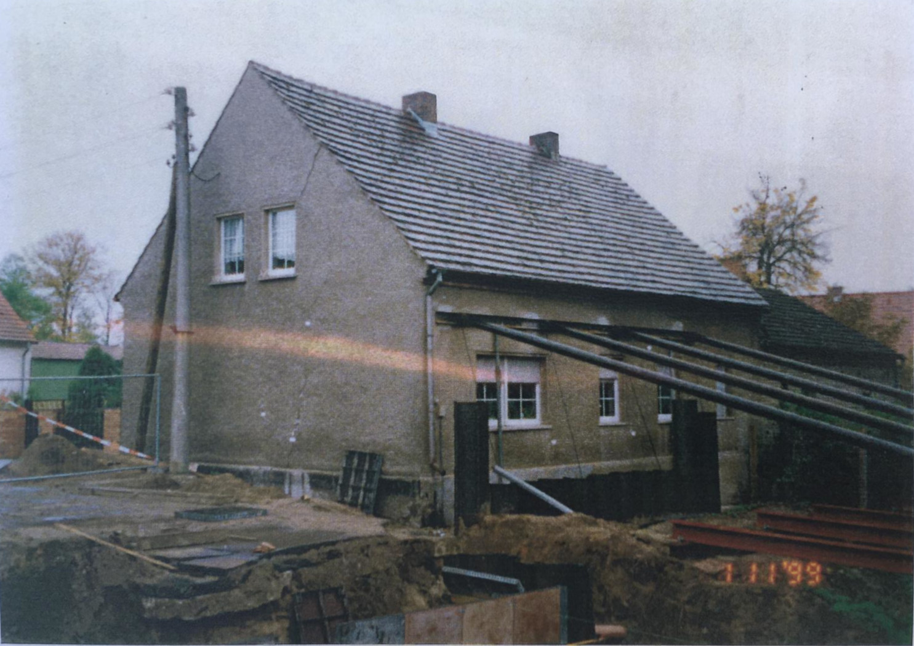

# Brückenbau zerstört Wohnhaus

Vor 22 Jahren erneuert das Land Brandenburg die Brücke über die Malxe in Heinersbrück. Hier befindet sich ein Wohnhaus
in unmittelbarer Nähe zur Brücke. Sehr lange kämpft besonders die Ehefrau der Familie gegen die Baumaßnahmen. Sie selbst
hat sich an einen Bagger gekettet, um ihr Haus zu retten. Obwohl das Land Sicherungsmaßnahmen am Wohnhaus ergreift, muss
die Familie während der Brückenbauarbeiten ihr Wohnhaus verlassen. Das Haus übersteht die Baumaßnahmen nicht, wird
unbewohnbar und muss letztlich abgerissen werden.

Die Familie zieht gegen das Land vor Gericht. Das Gerichtsverfahren zieht sich über mehrere Jahre hin. Die Familie
gewinnt das Verfahren in erster Instanz, aber das Land geht in Revision. Während des langjährigen Prozesses versterben
beide Kläger. Die Tochter des Ehepaares erbt den bereits 8 Jahre andauernden Entschädigungsprozess. Die jugen Studentin
fühlt sich dem Druck den das Gericht und das Straßenbauamt auf sie ausüben nicht gewachsen. Sie beendet entkräftet das
Verfahren und zieht die Anklage zurück. Eine finanzielle Entschädigung erhält sie nicht.

An dieser Stelle möchten wir uns bei der hier erwähnten Tochter für die Unterstützung bedanken.
